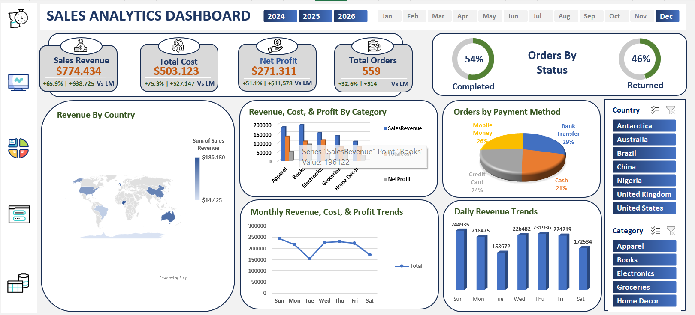
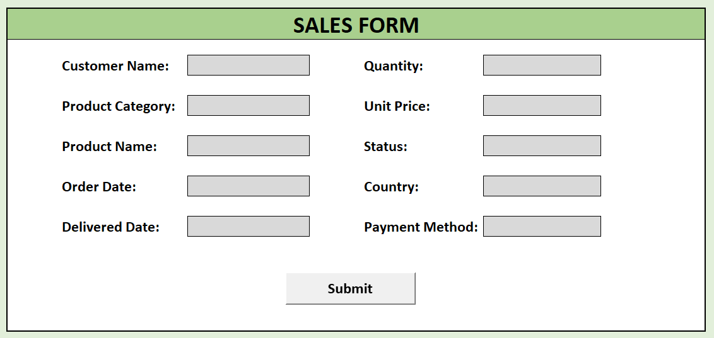
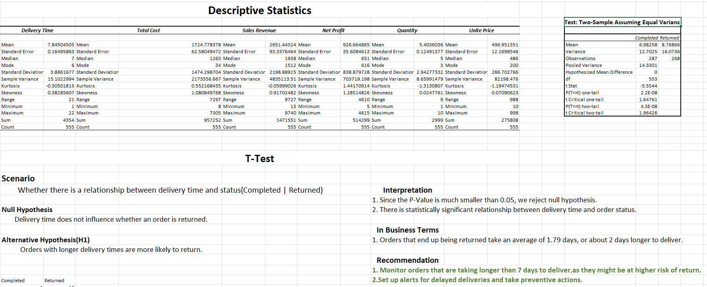

#  Retail Sales Analytics & Automation in Excel  
Interactive Dashboard + Statistical Analysis + VBA Data Entry  

---

##  Executive Summary

A retail company needed a centralized analytics solution to monitor sales performance, understand return behavior, and reduce manual reporting effort.  

Sales data existed, but stakeholders lacked a single tool to track KPIs, explore trends, and continuously add new data without breaking the reporting process.

To solve this, an end-to-end analytics workbook was developed in Excel. The solution integrates:

- Automated data entry  
- KPI modeling  
- Statistical analysis  
- Interactive dashboard (one-click refresh)

The tool enables stakeholders to self-serve insights while reducing manual reporting effort.

---

## 🎯 Business Problem

Completed orders directly drive revenue, yet the company lacked visibility into:

- Overall sales performance and profitability  
- Month-over-month KPI changes  
- Geographic and product category performance  
- Customer payment behavior  
- Whether delivery delays increase product return likelihood  

Without a centralized analytics solution, reporting required manual effort and limited stakeholders’ ability to explore trends and make data-driven decisions.

---

#  Dashboard Preview

---

## 🛠️ Methodology

The solution was built as a complete analytics workflow inside Excel.

### 🔹 Data Cleaning

- Standardized date formats  
- Removed duplicates  
- Handled missing values  
- Prepared analysis-ready dataset  

### 🔹 Data Processing

Created calculated fields for:

- Delivery time  
- Sales revenue  
- Total cost  
- Net profit  
- Month / Year extraction  

### 🔹 Data Modeling

- Built PivotTables to power KPIs  
- Created Month-over-Month comparison engine  

### 🔹 Dashboard & Automation

The dashboard allows filtering by:

- Year  
- Month  
- Country  
- Product Category  

#### Key Features

- KPI cards (Revenue, Cost, Profit, Orders)  
- Month-over-Month comparison  
- Revenue map by country  
- Category profitability comparison  
- Monthly & daily sales trends  
- Orders by status & payment method  

---

#  Data Entry Automation (VBA)

The Sales Form:

- Validates user input  
- Appends new data to the database  
- Clears the form after submission  
- Confirms successful submission  
- Enables one-click dashboard refresh  

---

#  Statistical Analysis

### Hypothesis Testing

**H₀:** Delivery time does not influence order returns  
**H₁:** Longer delivery times increase return likelihood  

### Result

- P-value < 0.05  
- Returned orders take ~1.79 days longer to deliver  

---

##  Results & Business Recommendations

The analysis revealed a clear relationship between delivery delays and product returns.

### Recommended Actions

- Monitor deliveries exceeding 7 days  
- Implement alerts for delayed shipments  
- Improve logistics tracking for high-risk orders  

Stakeholders can now self-serve insights and make faster decisions without manual reporting.

---

##  Skills Demonstrated

###  Excel & Analytics
- PivotTables & Slicers  
- Advanced formulas (VLOOKUP, TEXT, DATEDIF, IFERROR)  
- Conditional formatting  
- Data Analysis Toolpak  

###  Automation
- VBA macro development  
- Automated data refresh workflow  

###  Business Analytics
- KPI development  
- Dashboard storytelling  
- Statistical hypothesis testing  

---

## 📂 Workbook Structure

| Sheet | Purpose |
|-------|----------|
| Retail Store Sales | Cleaned dataset |
| KPI | PivotTables & MoM calculations |
| Dashboard | Interactive analytics interface |
| Sales Form | VBA-powered data entry |
| Analysis | Descriptive statistics & T-Test |

---

##  Next Steps

- Replace VLOOKUP with XLOOKUP  
- Add automated monthly reporting export  
- Implement anomaly detection alerts  
- Expand analysis using Power BI  

---
